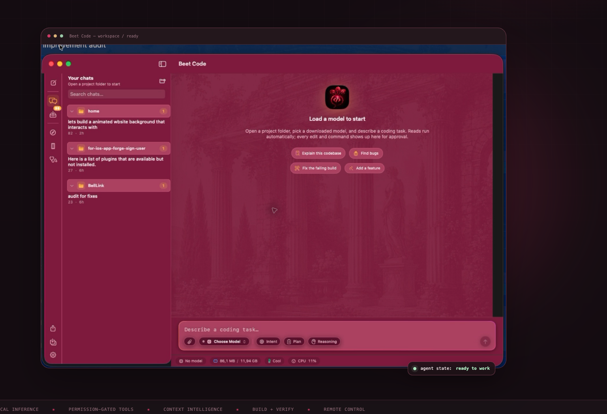

# Vamp Assistant

A native, assistant-first **Apple Silicon macOS companion**. Vamp Assistant runs local MLX models through Metal, supports remote providers, controls browser and Mac workflows with approval, and opens Code only when a project is needed.

[](https://github.com/Mesutcydev/vamp-assistant/releases/latest)
[](LICENSE)

<p align="center">
  
</p>

<p align="center">
  <a href="https://mesutcydev.github.io/vamp-assistant/">Explore Vamp Assistant</a> ·
  <a href="https://github.com/Mesutcydev/vamp-assistant/releases/latest">Download the latest release</a>
</p>

## Product previews

Vamp Assistant keeps chats, specialist bots, browser and Mac control together. Assistant mode can search and browse the web and save generated text documents through a user-controlled native Save panel; projects, shell, files, and Simulator remain available through the optional Code capability.

| Homepage | Imported chats |
| --- | --- |
|  |  |

| iOS Simulator | In-app browser |
| --- | --- |
|  |  |

| Remote sessions |
| --- |
|  |

The [Vamp Assistant site](https://mesutcydev.github.io/vamp-assistant/) has the full preview gallery, light/dark mode, and app details.

## Vamp Assistant for iPhone and iPad

The repository includes a native SwiftUI companion app that connects to the Mac app's existing private Remote Sessions endpoint. It supports camera QR pairing, one-tap reconnection, secure token storage, session browsing, new local/API sessions, live responses, prompts, stop controls, approvals/questions, and permission-gated clipboard and file exchange.

[Download the latest unsigned iPhone/iPad IPA](https://github.com/Mesutcydev/vamp-assistant/releases/download/ios-v0.1.35/Vamp-Assistant-iOS-0.1.35-build-57-unsigned.ipa)

[Add the Vamp Assistant AltStore source](https://mesutcydev.github.io/vamp-assistant/apps.json)

Build an unsigned sideloadable IPA:

```sh
./scripts/package-beetcode-remote-ios.sh
```

The resulting `Vamp-Assistant-iOS-*-unsigned.ipa` can be re-signed with AltStore, SideStore, Sideloadly, or a personal Apple development profile. Keep both devices on the same trusted LAN or Tailscale network, then paste the address or scan the QR shown by **Vamp Assistant → Remote Sessions**.

### Optional TinyFish web search

Vamp Assistant can use [TinyFish Search](https://docs.tinyfish.ai/search-api) for current, ranked web sources, snippets, and URLs. Add the key in **Settings → Providers → TinyFish Search**; it is stored in the Mac Keychain and the read-only `web_search` tool is then available in Assistant, Code, browser-control, and bot runs. The assistant can pass a returned URL to `web_fetch` or the in-app browser for verification. For headless/CLI use, set `TINYFISH_API_KEY` before launching the host. No TinyFish key is bundled with the app.

**Install:** [download the latest Apple-silicon DMG](https://github.com/Mesutcydev/vamp-assistant/releases/download/v0.10.25/Vamp-Assistant-0.10.25-build-78.dmg) or [ZIP](https://github.com/Mesutcydev/vamp-assistant/releases/download/v0.10.25/Vamp-Assistant-0.10.25-build-78.zip), open it, and move **Vamp Assistant.app** to Applications. Apple Silicon + macOS 15+.

> Gatekeeper will warn — this build is Apple Development–signed, **not notarized** (Developer ID certs are revoked). Right-click → Open, or `xattr -dr com.apple.quarantine "/path/to/Vamp Assistant.app"`.

> Phase 1 deliberately focuses on one polished path: MLX + MLX-quantized safetensors + core coding tools. GGUF/llama.cpp has since shipped (v0.2+, see the GGUF entries in the model catalog).

### Release verification

Run the Apple apps CI matrix before release. It tests the macOS and iOS targets
and builds both Release configurations with Xcode 26.6. Local test runs that
exercise Ship Center must export both `DEVELOPER_DIR` and
`TEST_RUNNER_DEVELOPER_DIR` to the full Xcode developer directory.

The DMG packager defaults to a clearly named `preview` artifact. Public packaging
requires a Developer ID signed app with hardened runtime and a stapled
notarization ticket:

```sh
VAMP_DISTRIBUTION_CHANNEL=public ./scripts/package-beetcode-dmg.sh "/path/to/Vamp Assistant.app"
```

The gate validates signatures, entitlements, notarization, and Gatekeeper before
creating the DMG. Packaging never signs or submits the app. Both packagers refuse
to overwrite an existing version/build artifact; choose a new build number.

See [release audit](docs/RELEASE-AUDIT-2026-09-04.md) and
[implementation and verification log](docs/RELEASE-IMPROVEMENTS-2026-09-04.md)
for the current release work.

## v0.10.25 — Remote unlock and richer mobile control

- Remote unlock now enters credentials at the physical macOS login window and
  is accepted only through an authenticated Tailscale session when the host
  toggle is enabled. Attempts are rate-limited and submitted passwords are
  cleared immediately.
- The iPhone and iPad companion shows the unlock form only when the host reports
  that secure remote unlock is available, then refreshes the session after a
  successful unlock.
- Remote settings, model selection, bot console, approval previews, app-window
  control, and stream recovery are expanded across the native companion.
- TinyFish Search can be enabled with a Keychain-stored API key for current web
  results without bundling provider credentials in the app.


## v0.2 — safety, durability, diagnostics

Implemented and verified by the test suite (`xcodebuild … test`, 120+ tests,
no model weights or Metal needed):

- **Workspace confinement**: canonical realpath containment (symlink-safe,
  `/private/var`-consistent), per-operation intent, resolved-path reuse,
  bounded reads, excluded-descendant skipping.
- **Shell policy**: exact safe-command auto-approval (operators, substitution,
  redirection, backgrounding, and outside paths always ask); sanitized
  environment without Git override variables; process-group kill on
  timeout/cancel; typed command results.
- **Checkpoints**: sanitized git environment, foreign-tree rejection, tree
  retention under local refs (GC-safe), per-workspace serialization, index
  preservation on restore, symlink-safe cleanup, newline-safe paths.
- **AgentLoop**: run-state guard, one-shot stream completion, cancellation
  mapping, request-scoped approvals, one-tool-call protocol enforcement,
  assistant/tool-result history pairing, checkpoint-before-mutation with
  failure surfacing, deterministic fake-engine suite.
- **Durability**: encrypted (Keychain-key) sessions with redaction and
  bounded retention; AppPreferences restore with validation; download
  manifests with pause → quit → relaunch → resume; repair of stale model
  registry entries; memory-pressure model dumps clear the UI state.
- **Diagnostics**: `build_diagnostics` tool with Swift/Xcode output parsing,
  grouped-by-file UI, and optional post-edit verification that always runs
  through the approval path.
- **Repository context**: bounded workspace index respecting ignore rules and
  vendor exclusions, with per-file symbol summaries in the system prompt.

Manual acceptance checklist: [`docs/ACCEPTANCE-v0.2.md`](docs/ACCEPTANCE-v0.2.md).

## Workspace Intelligence

A deterministic, UI-independent intelligence layer (`Core/Intelligence/`) —
no LLM in retrieval, every fact provenance-labeled:

- **Workspace core**: move-safe workspace IDs, real git state, nested
  `.gitignore`, SHA-256 content hashing, snapshot deltas (rename-aware).
- **Symbol graph**: Swift parser → SQLite nodes/edges; edges form only on
  unambiguous name resolution. SourceKit-LSP can *upgrade* provenance, never
  invent symbols.
- **Incremental indexing**: delta-driven updates, FSEvents watching,
  invalidation journal; 1,000-file repo indexes in ~1.8 s, updates in ~0.1 s.
- **Context compiler**: budgeted `ContextPacket` (capsule ≤ 800 tokens,
  per-section caps) with per-item *why / confidence / freshness / cost*.
- **Knowledge**: evidence-gated durable knowledge with secret + injection
  scanning, conflict detection, and hash-based staleness.
- **Sessions**: branch-scoped working state and deterministic handoff
  packets.
- **Impact & claims**: graph-derived impact reports and structural claim
  verification (`callExists`, `testCoversSymbol`, …) with evidence.
- **Framework semantics**: SwiftUI/SwiftData entity detection (screens,
  providers, models, permissions, entitlements, endpoints…).
- **Agent-loop integration**: every task message is prefixed with a
  bounded `<workspace_intelligence>` block compiled for that task
  (configurable via `AgentLoop.Configuration.intelligenceContext`);
  workspace switches trigger a background incremental index.
- **Surfaces**: in-app Context Inspector (status bar pill), `lf intel …`
  CLI, a 12-tool MCP server (`lf intel serve-mcp`), and the
  `WorkspaceIntelligence` Swift facade.

Docs: [`ARCHITECTURE.md`](docs/ARCHITECTURE.md) ·
[`CONTEXT_COMPILER.md`](docs/CONTEXT_COMPILER.md) ·
[`KNOWLEDGE_MODEL.md`](docs/KNOWLEDGE_MODEL.md) ·
[`SDK.md`](docs/SDK.md) · [`BENCHMARKS.md`](docs/BENCHMARKS.md) ·
[`SECURITY.md`](docs/SECURITY.md)

## v0.3 — BYOK, simulator, memory, reasoning

- **BYOK remote engines**: OpenAI, DeepSeek, LongCat, Alibaba DashScope,
  Alibaba Token Plan, Gemini, OpenRouter, **Anthropic** (native Messages
  API), and a **Custom** OpenAI-compatible endpoint (Ollama, LM Studio,
  vLLM, Groq, proxies — key optional) — Keychain-backed API keys,
  provider/model settings with a live model-list refresh and a Test button,
  and a Model Manager section to switch between the local MLX engine and a
  remote provider. The agent loop is engine-agnostic.
- **Built-in iOS Simulator side panel**: docked next to the chat (activity
  rail toggle), with device list, boot/shutdown, app install/launch, and a live
  screenshot stream (public `simctl` APIs).
- **argent integration**: when `argent` is installed, the agent gets
  `sim_list_devices`, `sim_boot_device`, `sim_launch_app`, `sim_tap`,
  `sim_swipe`, `sim_type`, `sim_describe`, and `sim_screenshot` tools to
  drive the simulator — tap/swipe/type go through the normal approval card.
- **Vision**: `describe_image` tool using vision-capable BYOK providers
  (OpenAI / Gemini / OpenRouter). A local SmolVLM engine plugs into the same
  seam once mlx-swift-lm ships VLM support.
- **Memory**: Mem0/Letta-style per-workspace memory with modes (off /
  session summaries / facts / full); durable facts plus earlier-session
  summaries are injected into the system prompt with keyword relevance
  ranking; the agent can maintain facts with `memory_add`/`memory_delete`.
- **Compression options**: light / standard / aggressive context compaction
  (assistant/tool-result pairing always preserved).
- **Reasoning toggle**: show or hide `<think>` chain-of-thought blocks
  (local Qwen3 and remote reasoning models, whose `reasoning_content` is
  folded into think blocks).
- **Thermal fix**: `ProcessInfo.thermalState` alone stays `.nominal` on
  warm Apple Silicon Macs; a CPU-load proxy (public `host_processor_info`)
  now escalates the effective state under sustained load, so the status bar
  and throttling reflect real warmth.
- **UI**: animated Copilot-style composer with configurable flow presets,
  streaming cards with a typing indicator, richer approval cards, and
  diagnostics with breadcrumbs and grouped-by-file presentation.
## v0.4 — hardening and agent competitiveness

- **Restored-session seed**: continuing a restored session seeds the loop
  with the persisted record so history and checkpoints carry over.
- **Simulator off the main actor**: `SimctlRunner` runs simctl through the
  process-group shell runner (hard timeouts, cancellation); the panel state
  lives in `@MainActor SimulatorContext`.
- **Stronger confinement**: the workspace root is re-validated on every
  path resolution; symlink/prefix checks were hardened with more tests.
- **Remote switch unloads local**: activating a BYOK provider explicitly
  unloads the resident MLX model first.
- **Hard tool timeouts everywhere**: git, rg, argent, and simctl all run
  through `ShellRunner` (posix_spawn + process group + kill on timeout).
- **Build to install to launch to screenshot to inspect**: `sim_build_run`
  runs the full loop in one tool call (xcodebuild, simctl install/launch,
  screenshot, vision describe), so the agent can verify UI work end to end.
- **Verification before completion**: with verification enabled, a failing
  build-diagnostics pass refuses `attempt_completion` and feeds the errors
  back until the build is clean.
- **Failure classification**: tool failures carry typed tags
  (`[timeout]`, `[command exit N]`, `[workspace]`, etc.) so the model and UI
  can react without string-sniffing.
- **Agent phase state machine**: planning, awaiting plan approval, working,
  awaiting approval/question, verifying, finished - surfaced in the UI.
- **Task-ranked repo context**: the workspace index ranks files by task
  relevance so the prompt leads with what matters.

## v0.5 — local API server + concurrency hardening

- **OpenAI-compatible local API server**: `Core/Server/LocalAPIServer` is a
  zero-dependency HTTP/1.1 server over POSIX sockets, bound to 127.0.0.1
  only (nothing outside this Mac can reach it). Routes: `GET /v1/models`,
  `POST /v1/chat/completions` (streaming SSE + non-streaming), `GET
  /health`, CORS for browser clients. The endpoint is **stateless**: every
  request resets the engine session and replays the full conversation, so
  Codex `--oss`, Claude Code, Aider, or any OpenAI-format client can drive
  Vamp Assistant's loaded model. Toggle it in Settings → General → Local API
  Server (port configurable, status dot, copy-curl-example), or run it
  headless with `lf serve [--port N] [--model <catalog-id>]`.
- **Keychain deadlock chain eliminated (F9/F9b/F9c)**: session
  encryption previously held the store mutex across `SecItemCopyMatching`
  — an invisible Keychain prompt (which ad-hoc re-signed builds trigger
  after every binary change) froze the app and the test host. All
  Keychain access now (1) runs outside locks, (2) fails fast with
  `kSecUseAuthenticationUISkip` and a visible one-click "Unlock" banner in
  the sidebar, and (3) uses a deterministic in-process key under XCTest so
  the suite never touches securityd.
- **Layering fix**: `ComposerFlow` and `SimctlRunner` moved from App to
  Core so the CLI target compiles (it previously didn't).
- **Settings**: Local API Server card; composer style + animated-border
  toggle moved out of the chat toolbar into Settings → General.

## v0.6 — provider hardening + agent-controlled browser

- **Provider audit fixes (13 findings)**: UTF-8-safe SSE parsing (multi-byte
  characters no longer corrupt across chunk boundaries), tool-role
  translation so agent turns work on OpenAI/Gemini/Anthropic, reasoning-model
  handling (`max_completion_tokens`, no forced temperature), Gemini
  `systemInstruction` + adjacent-role merging, inactivity watchdog + one
  bounded 429/503 retry honoring `Retry-After`, truthful token usage
  (`stream_options`/`usageMetadata`/Anthropic `usage`), live `/v1/models`
  refresh in Settings, API keys out of URLs (Gemini `x-goog-api-key`
  header), User-Agent everywhere.
- **In-app browser the agent controls**: docked WKWebView panel (activity
  rail toggle, URL bar, back/forward/reload). Agent tools: `browser_read`
  (text/links/info, auto-approved), `browser_screenshot`, and the
  approval-gated `browser_navigate` / `browser_click` (selector or visible
  text) / `browser_type` / `browser_eval`. All agent-supplied strings are
  escaped through one JS-literal boundary; screenshots land in
  `.beetcode/screenshots/`.

## v0.7 — Intent replaces the Lattice; composer redesign

- **The Intent Lattice is gone.** The 48-cell role × context grid (and its
  weights, muted states, and dead superposition toggle) is replaced by
  **Intent**: four role chips (Research / Build / Review / Verify) and four
  focus chips (@files / @git / @docs / @codebase) with real, bounded
  resolvers, plus role-curation presets. Selection serializes into a plain,
  auditable preface to the message — no invented fences, no weight metadata,
  empty sources honestly marked `(nothing found)`.
- **Redesigned composer**: one elevated card (editor + accessory row),
  attachment chips, Intent picker popover with active-count badge, Plan and
  Reasoning toggle chips, honest token estimate (`≈ chars/4` against the
  model's real context window; absolute-only when the window is unknown),
  and send↔stop morphing. Enter sends, Shift+Enter newline, ⌘↩ sends, Esc
  stops the agent (single Esc owner — the old conflict is gone).
- Per-workspace composer drafts (prompt + intent selection) persist across
  sessions; intent is one-shot and clears on send.

## v0.8 — activity rail, chat import, themes, GGUF context + MTP

- **Activity rail**: a dedicated left rail now owns all panel toggles
  (simulator, browser, diagnostics, …) plus the new-chat button in a fixed,
  predictable order; the old chat-toolbar buttons and segmented picker are
  gone. Sidebar lists imported chats under distinctive, collapsible
  per-project headers instead of one flat list.
- **Chat history import**: Claude, Codex, and Cursor session history imports
  through a live parser with visible per-file status; imported transcripts
  keep their original structure (roles, tool calls, timestamps) so they read
  like native Vamp Assistant sessions. Streaming is bounded (16 MB per file /
  512 KB per message) so a huge history can't wedge the app.
- **Workspace history digest**: the agent's system prompt carries a bounded
  digest of what earlier sessions in this workspace were about — Vamp Assistant's
  own and imported ones alike.
- **Plugins**: Settings gains a Plugins tab; external command plugins are
  discovered and runnable from the app.
- **Themes**: light / dark / **beet** — beet mode tints the whole UI (not
  just accents), with contrast tuned for readability. The coding font and
  dark-mode palette were polished; the assistant avatar is now the beet logo
  instead of the generic sparkle.
- **KV-aware GGUF context admission**: the fixed 32 K context clamp is gone.
  The engine sniffs transformer dims from the GGUF header, prices KV cache
  bytes per token, and buys as much context as the RAM budget left after the
  weights affords (256 K sanity ceiling, 4 K floor). Unsniffable headers keep
  a conservative 32 K fallback.
- **MTP speculative decoding**: GGUF builds with nextn predictor tensors
  (e.g. Qwythos-9B MTP) launch llama-server with `--spec-type draft-mtp`
  automatically, with a self-healing retry without the flag when the server
  binary is too old. See [`docs/MTP-FEASIBILITY.md`](docs/MTP-FEASIBILITY.md).

## v0.8.4 — provider interoperability

- **OpenCode compatibility**: imports opencode.json / opencode.jsonc,
  provider and model definitions, Markdown commands and agents, ordered
  permission rules, and local or remote MCP servers. Build and Plan agents
  are available natively in the composer.
- **Major provider coverage**: OpenAI Responses and chat completions,
  Anthropic Messages, Gemini, OpenRouter, DeepSeek, Alibaba DashScope,
  LongCat, OpenCode Zen/Go, Mistral, Groq, xAI, Together AI, Fireworks,
  Cerebras, Perplexity, Cohere, Hugging Face, NVIDIA NIM, DeepInfra, and
  Tabitoken.
  Custom OpenAI-compatible endpoints continue to cover Ollama, LM Studio,
  vLLM, llama.cpp, and private gateways.
- **Provider-aware model picker**: API and local models have separate
  menus; each remote model keeps its provider, protocol, endpoint, headers,
  capabilities, and model id together so a model-list refresh cannot select
  the wrong gateway.
- **Credential safety**: imported {env:…} / {file:…} values stay in memory,
  saved credentials remain in the macOS Keychain, and no endpoint or session
  export includes an API key.
- **Responsive composer**: the provider, agent, Auto/Goal, Plan, and
  Reasoning controls remain usable in narrow and portrait-sized windows.

## v0.8.5 — task reliability and provider polish

- Per-model capability overrides now apply to the exact provider/model
  endpoint, including imported OpenCode and dynamic gateway profiles.
- The task sidebar persists pins, workspace paths, running phases, and
  review-needed status for failed checks or tool errors.
- Verification detects Xcode workspaces/projects, XcodeGen projects, and Swift
  packages, preferring tests when the project contains test sources.
- Subagents have explicit research, implement, verify, and review roles with
  role-appropriate tools and inherited approval policy.
- `.beetcode.json` and `.beetcode.jsonc` provide shareable, non-secret project
  policy for agent defaults, plan/goal behavior, verification, tool filters,
  permissions, context hints, and answer style; credentials remain in the
  Keychain.
- Provider credentials accept common copied header forms such as `Bearer …`
  and `api_key=…` without storing the wrapper.

Project policy reference: [`docs/PROJECT-POLICY.md`](docs/PROJECT-POLICY.md).

## v0.10.10 — Remote folders, bots, and safer sessions

- Creating a Code folder from the phone works even when `Documents/BeetCode` does not exist yet, including iCloud Desktop & Documents.
- Remote Auto / Full Access apply only to that phone run and no longer rewrite Mac Settings.
- Sensitive home trees (`.ssh`, Library except iCloud documents, Trash) cannot be opened as a remote workspace.
- Linux micro-VMs run the bot’s shell via `container exec`; Navigator enables computer control for that run only.
- One bot computer per Builder, Reviewer, Navigator, and Researcher; the phone can prepare them on the Mac.
- Each specialist bot has a private in-app browser (cookies and logins stay with that bot).
- Follow-ups can Queue or Steer while a run is in progress.

## v0.10.9 — Remote Chat/Code workspaces

- Vamp Assistant can start Chat (no folder) or Code (one Mac project folder), matching the Mac toolbar.
- Code mode lists recent folders, opens a path under home, or creates a new folder in `Documents/BeetCode`.
- The Mac Remote host exposes `/api/workspaces` and starts sessions in the chosen folder.

## v0.10.8 — Gemini compatibility and Remote reliability

- Native Gemini requests now match Google's current `generateContent` contract, including live model IDs, tool calls, and thought signatures.
- Saved Gemini 3.7 choices remap at launch so a valid key is not rejected for a retired model id.
- Vamp Assistant stays on sessions when the Mac drops, with a reconnect banner, disabled composer, and specific error titles.
- Browser tools keep load state and navigation policy even when the docked panel is closed.

## v0.10.7 — Optional bots and in-chat models

- iPhone and browser remotes can start a plain Vamp Assistant chat without a specialist bot; Assistant is the default, and bots stay optional.
- Existing chats can change the model for the next turn instead of staying locked to the session default.
- Bot computers are no longer auto-attached; start/stop them and attach only when you want an isolated workspace.

## v0.10.5 — Persistent remote control and sharing

- Added a premium native iPhone session/conversation interface, new local/API session creation, and a compact appearance menu.
- Paired clients reconnect with one tap after the host returns; paired trust survives normal Mac app restarts and remains revocable.
- Added explicit clipboard and 20 MB file exchange for the browser and iOS client, protected by a first-use Mac permission sheet and route-level enforcement.
- Fixed the desktop Chat tab so reselecting it cannot clear the current chat, and moved Remote Sessions into a compact lower-right home action.

## v0.10.4 — Mobile remote conversation layout

- Replaced the stacked mobile sidebar and duplicate conversation header with one compact chat bar and a dedicated Sessions sheet.
- Reclaimed vertical space for the transcript, increased mobile message readability, and moved appearance and browser revocation into the session sheet.

## v0.10.3 — Remote prompt reliability

- Remote Sessions is now a primary homepage action with direct access to pairing and connected sessions.
- Paired browsers can continue idle sessions even if encrypted queue persistence is temporarily unavailable, fixing the connected-but-unable-to-send failure.

## v0.10.2 — Home action cleanup

- Removed the duplicate hero-level model button; the composer model pill is now the single model-selection entry point.
- Kept the distinct Open Project Folder action and the integrated Chat/Code toolbar switcher.

## v0.10.1 — Warm-plum home redesign

- The home surface centers the task composer beneath the Vamp Assistant identity, with a restrained ambient glow and reduced-motion support.
- Dark and light appearances use a warm-plum palette with clearer surface depth, softer status colors, and more comfortable contrast.
- Chat history is text-first, with quieter selection, a stronger workspace switcher, and a prominent monochrome New Chat action.
- Browser, Simulator, and Diagnostics are consolidated in the window toolbar; the sidebar footer now contains only Models and Settings.
- Active conversations retain the familiar bottom composer and all existing model, workspace, approval, import, and agent behavior.

## v0.10.0 — Agent reliability and native reading

- Local and API models can drive the iOS Simulator through the same observe, act, and verify loop, with memory-safe simulator tools available to constrained local models.
- Semantic context checkpoints, automatic compaction, elastic model/cache release, and reversible prompt/KV caching improve long-running agent stability on 16 GB Macs.
- Assistant answers use a larger native reading scale with structured paragraphs, headings, lists, quotes, code, and horizontally scrollable Markdown tables.
- My Chats and Other Tools use clearer source thumbnails, selection surfaces, metadata hierarchy, and keyboard search.
- Appearance settings now include persistent Compact, Comfortable, and Large text sizes.

## v0.9.9 — Native chat reading and history polish

- Assistant answers now render as real Markdown blocks with comfortable paragraph, heading, list, quote, divider, and code spacing.
- Completed answers show compact token, generation-speed, elapsed-time, and copy controls, and the transcript follows the model through the final completion card.
- Chat history uses a quieter native text-first hierarchy inspired by Codex and Cursor, with clearer selection, project grouping, search, rename, pin, export, and confirmed deletion.
- The completion card and New chat action now blend into the app instead of competing with the answer.
- Qwen3.5 9B 4-bit is verified on an M4 Mac with 16 GB, including a real structured Markdown generation.

## v0.9.8 — Qwen3.5 9B compatibility

- Unified Qwen3.5 MLX checkpoints now load correctly when their tensors retain the `language_model.*` namespace.
- The compatibility adapter remaps tensor names through lightweight temporary links; it does not duplicate the 4.7 GB model file.
- Verified on an M4 Mac with 16 GB by loading the installed Qwen3.5 9B abliterated 4-bit checkpoint and completing a real generation in 5.3 seconds.
- The compatibility behavior is covered by 744 unit tests plus 3 UI tests, including an opt-in live-model smoke test.

## v0.9.7 — Readable answers and faster follow-up

- Assistant replies render with comfortable line spacing and repair common missing paragraph boundaries from local models without changing saved conversation text or code blocks.
- Every model receives concise Markdown readability guidance for paragraphs, headings, and lists.
- Completed chats now include a clear New chat button that resets the finished state and opens a fresh conversation.
- Qwen3.5 9B 4-bit remains available on M4 Macs with 16 GB as a tight configuration, with active cooling recommended for sustained generation.
- The verified suite covers dense-answer repair, code-fence preservation, prompt guidance, and device-tier model fit with 743 unit tests plus 3 UI tests.

## v0.9.6 — Chat without a project

- Vamp Assistant can now start and restore ordinary chats without opening a project folder.
- Chat-only sessions expose no files, terminal, build tools, workspace context, project instructions, memory, hooks, checkpoints, MCP tools, or subagents.
- The welcome screen, composer, empty state, and sidebar clearly distinguish chat-only conversations from project work.
- Opening a project restores the complete coding workflow, while leaving a project starts a fresh isolated chat.
- The verified suite covers project-free prompting, persistence, launch behavior, and the existing project-mode workflow with 741 unit tests plus 3 UI tests.

## v0.9.5 — Safer sessions and focused native surfaces

- The agent receives an exact runtime capability map before large tool schemas, keeping project instructions, policy, memory, and available verification paths visible on constrained context windows.
- Failed encrypted-session saves are reported to the user and retained in memory for retry after Keychain or storage access recovers.
- Computer control is now explicitly opt-in, and the workspace intelligence inspector can be hidden without disabling the agent's index.
- Model Manager detects the Mac's Apple-silicon generation and unified-memory tier, recommends a daily chat and vision model, and groups MLX and GGUF options by fit.
- Chat, sidebar, and settings screens are split into focused native components, with localized strings and stricter Swift concurrency checks.
- Three launch-level UI smoke tests now cover the composer and history navigation alongside the 738-test deterministic unit suite.

## v0.9.4 — Native setup, delivery, and chat polish

- A one-screen welcome and readiness assistant takes users directly from a project folder to a working local, Codex, or API-backed coding model.
- The composer has a calmer native hierarchy, premium capsule actions, focused intent controls, and a dedicated Signing & Device Delivery setup.
- Ship Center verifies and archives macOS or iOS projects, signs with valid identities already in Keychain, exports IPAs, installs on a connected iPhone or iPad, or uploads an App Store Connect archive through Xcode.
- Chat history separates Vamp Assistant tasks from imported tools, groups imported conversations by project, and imports current Claude, Codex, and Cursor histories.
- Skills and declarative plugins can be discovered from Claude Code, Codex, Cursor, Copilot, Windsurf, OpenCode, Agent Skills, or a user-connected IDE folder without executing installers or hooks.
- Model, remote-session, history, and empty-state actions now share one accessible native button language, with direct recovery actions instead of menu-only instructions.

## v0.9.3 — Structured API answers and reasoning

- Remote reasoning deltas are reassembled into readable traces instead of one word per paragraph.
- Tool-call wire wrappers are removed from visible answers and exports, including empty `<tool_call>` tags.
- Assistant Markdown now preserves headings, lists, paragraphs, and code blocks across local and API-backed models.
- The release page, ZIP link, and GitHub Pages download buttons now point to the v0.9.3 build.

## v0.9.2 — Native Dark mode default

- Native Dark mode is now the default appearance for fresh installs.
- Existing installs with the legacy Beet launch appearance migrate once to native Dark; Beet mode remains available as an explicit choice.
- The release page, ZIP link, and GitHub Pages download buttons now point to the v0.9.2 build.

## v0.9.1 — Local model reliability and release links

- Local Llama 3.1, Qwen2.5, and Qwen3 GGUF turns share one clean answer path: reasoning and chat-template control tokens stay out of the transcript, while Markdown lists, code fences, line breaks, and indentation remain intact.
- Constrained local mode uses a smaller prompt, core coding tools, bounded context/output, and deterministic sampling so 16 GB Apple Silicon Macs can answer without exhausting memory or echoing the agent protocol.
- Imported MLX model folders keep their real model identity when the selected directory is named only `2-bit`, and multimodal/config metadata is detected before choosing the local engine.
- The release page, ZIP link, and GitHub Pages download buttons now point to the v0.9.1 build.

## v0.9.0 — ChatGPT account access and provider surfaces

- OpenAI account sign-in uses the official local Codex app-server browser/device-code flow; Vamp Assistant never stores ChatGPT refresh tokens or treats account access as an API key.
- Live account model discovery appears beside local and BYOK API models in the composer picker.
- Account-backed turns reuse the native transcript, reasoning, approvals, MCP/tool events, persisted thread continuity, and a working Stop/interrupt path.
- Settings now gives account access its own card and keeps API-key providers independent.

## v0.8.7 — fast local model readiness

- Local MLX activation now becomes ready as soon as the model session is constructed; weights page on first generation instead of blocking startup on a full-device prewarm.

## v0.8.6 — portable tasks and durable work

- Encrypted, versioned `.beetask` bundles export a bounded, redacted task
  transcript and require a passphrase on both export and import. Import always
  asks for a destination workspace; source paths and stale checkpoints are not
  trusted.
- Remote prompts can enter a durable queue while another task is running or a
  model is unavailable. Queue state survives relaunch, interrupted work is
  re-queued safely, and the native sidebar exposes the next task and removal
  controls.
- Concise, normal, and detailed response styles are enforced in the agent
  prompt, with workspace policy taking precedence over the global setting.
- Send, stop, and plan shortcuts are editable using readable forms such as
  `cmd+return` and `cmd+shift+p`.

## Requirements

- Apple Silicon Mac (arm64)
- macOS 15+
- **Xcode 26.6 or Xcode 27.0** / Swift 6 (the same `project.yml` builds on both)
- XcodeGen (`brew install xcodegen`)
- 8 GB Macs: Qwen3 1.7B is the recommended first model; 4B is marginal; 7B+ is refused by the admission gate on this tier.

## Build

```sh
xcodegen generate
xcodebuild -project BeetCode.xcodeproj \
  -scheme BeetCode \
  -destination 'platform=macOS' build

xcodebuild -project BeetCode.xcodeproj \
  -scheme BeetCode \
  -destination 'platform=macOS' test
```

The CLI harness builds alongside the app:

```sh
xcodebuild -project BeetCode.xcodeproj \
  -scheme BeetCodeCLI \
  -destination 'platform=macOS' build

# The binary is in Xcode DerivedData/Build/Products/Debug/BeetCodeCLI
lf status
lf download qwen3-1.7b-4bit
lf generate qwen3-1.7b-4bit 'Explain actors in one sentence.'

# Serve the model over an OpenAI-compatible local API (loopback only):
lf serve --port 1234 --model qwen3-1.7b-4bit
#   → POST http://127.0.0.1:1234/v1/chat/completions
```

## Architecture

```
SwiftUI
  └── AppState / AgentSessionController       UI boundary
        ├── ModelDownloadManager
        │     └── HFHubClient → SmartFileDownloader
        ├── MLXEngine → GenerationGate        in-process Metal inference
        │              └── MemoryAdvisor
        ├── ThermalMonitor / MemoryPressureCoordinator
        └── AgentLoop
              └── PermissionGate → ToolExecutor → core tools
```

The UI never directly manipulates MLX, files, or shell commands.

### Inference

- `mlx-swift-lm` 3.x (`MLXLLM`, `MLXLMCommon`) and `mlx-swift` are Swift Package Manager dependencies.
- `MLXEngine` loads a local model directory with `LLMModelFactory` and `HFTokenizerLoader`.
- `GenerationGate` serializes every Metal operation and queues cache clears until generation is idle. This avoids MLX's process-killing concurrent-command-buffer failure mode.
- Streaming uses `ChatSession` and Swift concurrency.

### Memory and thermal safety

`MemoryAdvisor` is the single model-load authority:

- Measures `phys_footprint`, not `resident_size`.
- Uses an 80% usable-RAM budget, 1.3× working-set overhead, and a configurable 500 MB headroom reserve.
- Verdicts: fit (<60%), marginal (60–95%), won't fit (>95%).
- Memory pressure warning clears MLX caches; critical pressure dumps the model only when this process is low on headroom, then blocks reloads for 20 seconds.
- Thermal hysteresis: 8 seconds heating / 15 seconds cooling; critical is immediate.
- Serious thermal state caps generation at 1,536 tokens; critical blocks new loads and caps at 512.

### Hugging Face downloads

- Token is stored in the macOS Keychain, never UserDefaults.
- Hub tree listing fetches file size, ETag, LFS SHA-256, and commit metadata.
- Each file uses explicit `Range: bytes=N-` requests and an `.incomplete.json` sidecar containing ETag, offset, total size, and expected digest.
- Pause survives app termination and resumes after a fresh ETag check; an HTTP 200 response to a resumed request correctly truncates and restarts.
- LFS files are SHA-256 verified before atomic rename; retries use exponential backoff with jitter; disk space is checked before transfer.
- The model manager downloads files sequentially so memory stays predictable and progress is easy to explain.

### Agent safety

The loop is:

```
generate → parse → PermissionGate → approval → Git checkpoint → execute → observe → repeat
```

Built-in tools:

- `read_file` (line-numbered, bounded, binary detection)
- `list_directory` (git/build directory filtering)
- `search` (`rg` when available, Swift fallback)
- `apply_patch` (exact SEARCH/REPLACE blocks)
- `write_file` (read-before-write enforcement)
- `run_command` (sanitized environment, bounded output, hard timeout)

Reads run automatically. Writes and commands need approval by default; approval cards show the exact command or diff. Command prefixes can be allowlisted in Settings.

Before the first approved write in a turn, `GitCheckpointer` snapshots the working tree using a temporary Git index. Restore also removes only newly-created untracked paths absent from the snapshot — never broad `git clean`.

The parser is engine-independent and accepts fenced tool JSON, Qwen `<tool_call>` tags, OpenAI `tool_calls` envelopes, comments, single quotes, trailing commas, and arguments encoded as a JSON string.

## Models

The bundled catalog is **per device**, not one global list. `DeviceProfile`
reads chip generation, Pro/Max/Ultra, unified memory, and Mac Studio
`hw.model` IDs. `CatalogLibrary` then shows only the matching lane:

- **8 GB** (M3/M4 Air) — Qwen3 1.7B, Nanbeige 4.1 3B, Nemotron 3 Nano 4B, Phi-4 mini, Llama 3.2 1B, Gemma 3 1B
- **16 GB M3/M4** — Qwen3.5 9B is available as a tight configuration (close memory-heavy apps; active cooling is recommended for sustained generation), alongside Ornith 1.5 9B, Llama 3.1 8B, and DeepSeek R1 8B (no 14B Pro models)
- **M5 Air 16 GB** — 16 GB set plus 24 GB Pro models; daily pick is Qwen2.5 Coder 14B
- **M5 Air 24 GB / M5 Pro 24 GB** — adds 32 GB class (Qwen3.5 27B, Nemotron Lightning); daily pick is 27B
- **M5 Air 32 GB / M5 Pro 36 GB** — adds Max-class 35B (Ornith 1.5 35B, Qwen3.5 35B)
- **M5 Max 64 GB+** — Studio flagships (Llama 70B, Nemotron Super 120B, Qwen3.5 122B)
- **24 GB Pro (M3/M4)** — Qwen2.5 Coder 14B, Phi-4, DeepSeek R1 14B, Ornith 9B
- **32–36 GB Pro (M3/M4)** — Qwen3.5 27B/35B, Ornith 1.5 35B, Nemotron Lightning 30B, Devstral, Mistral Small
- **Max (M3/M4)** — 35B/27B class plus Gemma 3 27B and Ornith 1.0 35B
- **Studio / Ultra (64–96 GB+)** — Qwen3.5 122B, Nemotron Super 120B, Llama 3.3 70B, Ornith 1.0 35B (no 1.7B toys)

Families: Qwen, Ornith, Nanbeige, NVIDIA Nemotron, Llama, Gemma 3, Phi, DeepSeek, Mistral/Devstral. GGUF twins still run through llama.cpp (`brew install llama.cpp`). Vision sidecars: SmolVLM2 500M on 8–16 GB, 2.2B on 24 GB+.

Catalog entries are ordinary Swift values; adding a user model later does not require changing the engine.

Import accepts MLX folders with root `config.json` and single or sharded
`.safetensors` weights, including Qwen-style nested `text_config`/vision
metadata, plus single-file or folder-contained GGUF models. A folder named
only for quantization, such as `2-bit`, inherits the parent model name in the
picker; the format and architecture are selected from the model metadata.

## Current limitations

- OpenCode configuration is imported into Vamp Assistant's native runtime; provider
  SDK plugins that depend on JavaScript-only middleware still need a native
  endpoint or a custom OpenAI-compatible gateway.
- OpenAI API access uses an OpenAI Platform API key. A ChatGPT web
  subscription is a separate product and is not silently converted into API
  credits; Vamp Assistant does not use private ChatGPT session cookies.
- GGUF models require a system `llama-server` (`brew install llama.cpp`); the
  in-process MLX engine has no such dependency.
- Multi-model residency is bounded by the memory advisor; on smaller tiers
  the coordinator still unloads before admitting another model.

## Open-source dependencies

- [mlx-swift](https://github.com/ml-explore/mlx-swift) — MIT
- [mlx-swift-lm](https://github.com/ml-explore/mlx-swift-lm) — MIT
- [swift-transformers](https://github.com/huggingface/swift-transformers) — Apache-2.0

The design was informed by the memory, thermal, downloader, and lifecycle patterns in [Mesutcydev/ios-local-llm](https://github.com/Mesutcydev/ios-local-llm), an MIT-licensed reference project.
